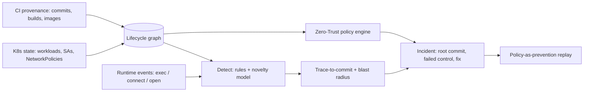

# STRATUM

**An open mini-CNAPP.** STRATUM links `commit → CI build → image → K8s workload → pod → runtime event` in one lifecycle graph. It checks Zero-Trust controls against that graph. When a runtime alert fires, it traces the alert back to the commit, the PR author and the control that should have stopped it, and it lists the blast radius.

When a pod misbehaves, STRATUM answers four questions in one step: *which code shipped this, which control failed, what else is exposed, and what policy fixes it.*

## Architecture



| Module | File | What it does |
| --- | --- | --- |
| Models | `stratum/models.py` | Typed dataclasses (Commit, Build, Image, Workload, RuntimeEvent, Control, Finding, Incident) |
| Collectors (synthetic) | `stratum/synth.py`, `stratum/dataset.py` | A deterministic cluster, CI provenance and event stream, with JSON I/O |
| Graph unifier | `stratum/graph.py` | Lifecycle graph, upstream trace, downstream blast radius |
| ZT policy engine | `stratum/policy.py` | 9 named controls (NIST 800-207 / CIS K8s / SLSA refs), simulated NetworkPolicy enforcement, YAML fix |
| Detect | `stratum/detect.py` | Rules (shell, SA-token read, external egress) plus a per-workload novelty model |
| Incident + metrics | `stratum/incident.py` | Trace, failed controls, blast radius, fixes, replay, accuracy metrics |
| CLI | `stratum/cli.py` | `generate`, `analyze`, `trace`, `blast`, `prevent`, `demo` |

## Quickstart

```bash
pip install -r requirements.txt    # runtime is stdlib-only; pytest is for tests
make demo                          # or: python -m stratum demo
make test
python -m stratum generate --out scenario.json
python -m stratum analyze --data scenario.json --json
python -m stratum blast alpine:3.14.0
python -m stratum prevent shop
```

The demo covers the five scenarios from the spec:
1. **Runtime-to-commit:** a shell in the `cart` pod is traced to its image, build, commit, author `bob` and PR #214.
2. **Control gap named:** C2 egress triggers `ZT-NET-01`, because namespace `shop` has no default-deny egress policy.
3. **Blast radius:** the deny-listed base `alpine:3.14.0` affects `frontend`, `cart` and `worker`.
4. **Policy-as-prevention:** apply the generated NetworkPolicy and replay. 2 of 2 malicious connects are blocked and 0 benign connects are blocked.
5. **Drift:** `debug-tools` runs an image that did not come from the trusted pipeline. There is no commit to trace, and `ZT-PROV-01` fires.

Reported metrics are detection rate, trace-to-commit accuracy, false positives and the controls named. On the seeded scenario all are perfect. That is expected for synthetic data and does not show how STRATUM performs on real traffic.

## Prior art and how this differs

| Existing | Gap STRATUM explores |
| --- | --- |
| Falco / Falcosidekick | Runtime detection, but no build lineage or control mapping |
| Kubescape / kube-bench | Posture scanning, but no runtime-to-code trace |
| Cilium Tetragon | eBPF runtime enforcement, but not fused with CI provenance and control coverage |
| Wiz / Prisma (CNAPP) | Commercial tools already doing lifecycle correlation, but closed and agent-heavy |

STRATUM does not try to compete with commercial CNAPPs. It is a small, readable, graph-centric slice of the idea: the code→runtime provenance trace plus control linkage.

## Status / TODO (Grade C/D/E, not built)

- [ ] Live K8s collector (kube API / client-go). A sample manifest is in `deploy/k8s/` and is optional.
- [ ] Tetragon/eBPF runtime ingestion. Events are synthetic today and use the same `RuntimeEvent` schema.
- [ ] Real TRACEGATE / in-toto / SLSA attestation verification. Today `signed` is a flag.
- [ ] Neo4j export and OPA/Rego policy export. The in-memory graph and Python rules are equivalent to them.
- [ ] Richer anomaly model (FEINT-style), and a way to evaluate it on real traces.
- [ ] React incident console.
- [ ] Mean-time-to-root-cause study against siloed tools (the research question).

## Safety

STRATUM is defensive and analytical. All data is synthetic and the IPs are from RFC 5737 documentation ranges. Nothing connects to a cluster or the network. The optional manifests are for a local kind/minikube lab only. See [THREAT_MODEL.md](THREAT_MODEL.md) and [SECURITY.md](SECURITY.md).
