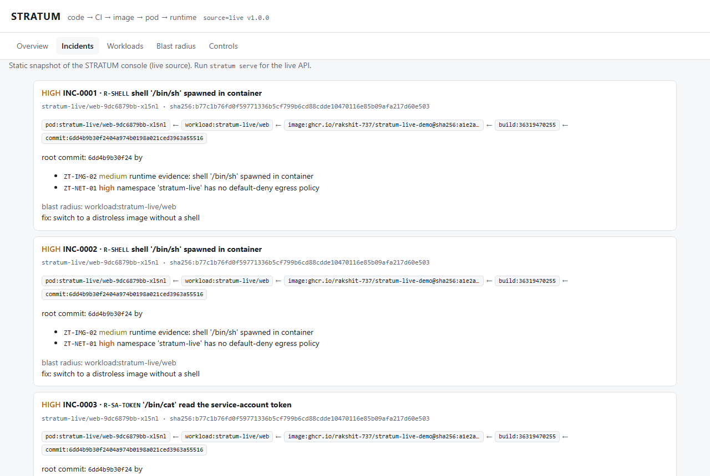
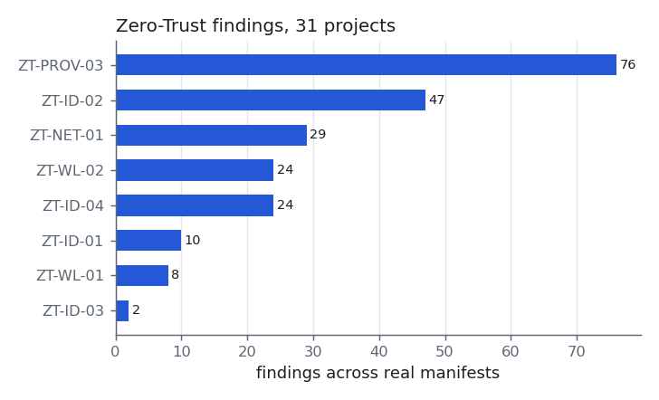
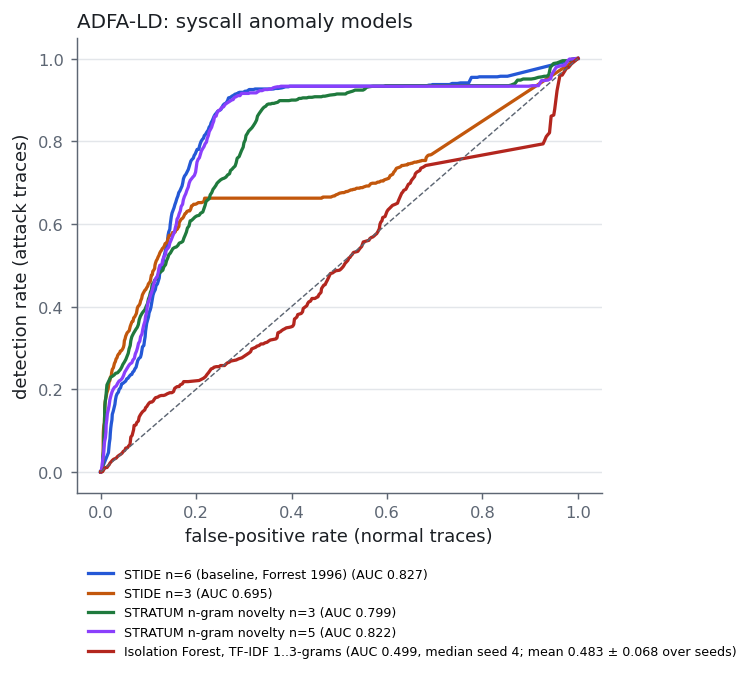
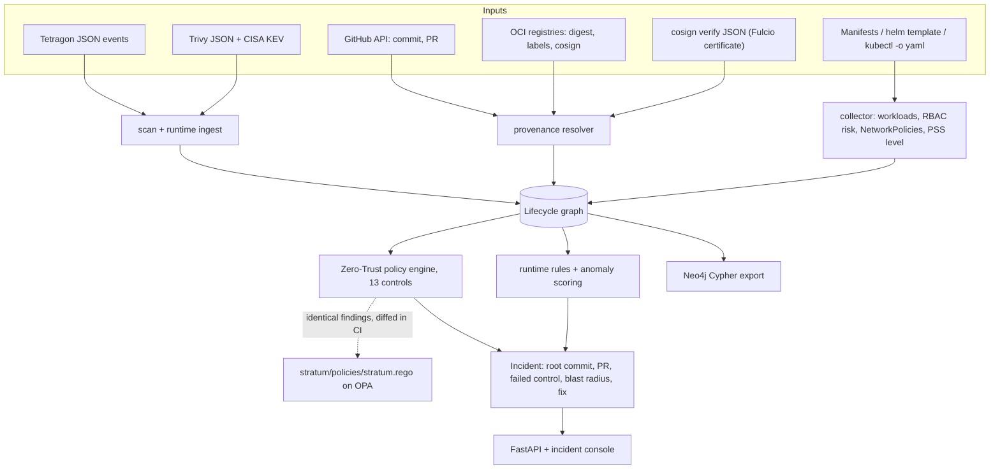

# STRATUM

[](https://github.com/rakshit-737/stratum/actions/workflows/ci.yml)
[](https://github.com/rakshit-737/stratum/actions/workflows/live.yml)

[](LICENSE)
[](https://rakshit-737.github.io/stratum/)


**Contribution: STRATUM joins each runtime eBPF alert to the running image digest, the CI run and commit named by that digest's verified Sigstore certificate, and the Zero-Trust control that should have stopped it.**

Evidence: in 5 live kind + Tetragon jobs, each with its own signed image and Fulcio certificate, all 55 demo-pod alerts traced to the right commit (5 / 5 runs, Wilson 95% CI 0.57-1.00). An unsigned image carrying the *right* revision label traced to none: label provenance (ablation arm A2) and a repository-level signature join (A4) attributed it to the commit in 5 / 5 runs, the digest-exact certificate join (A3) in 0 / 5 ([`results/live.md`](results/live.md), run [37085766270](https://github.com/rakshit-737/stratum/actions/runs/37085766270)). The forged image has the right label by construction, so this shows the join semantics on real sensor output; it is not a rate.

STRATUM is an open mini-CNAPP, not a Wiz. It puts `commit → CI build → image → Kubernetes workload → pod → runtime event` into one graph and checks 13 Zero-Trust controls against it. The controls are written in Python and mirrored in Rego (also exported as a Gatekeeper ConstraintTemplate). For each runtime alert it reports the commit and PR that shipped the code where provenance exists, the failed control, the fix, and every other workload built on the same base OS release (the blast radius).

It is evaluated on real public data:

- 31 real open-source install manifests and Helm charts (87 workloads)
- 86 real container images: all resolved to digests, 25 to a GitHub-verified commit, 49 scanned with Trivy and CISA KEV
- the upstream Kubernetes Pod Security Admission conformance fixtures
- real Cilium Tetragon events from a container-escape and C2 attack chain
- the ADFA-LD syscall benchmark, including a reproduction of a published LSTM result (not reproduced)
- container syscall traces recorded with `strace` in Docker on 5 GitHub runners
- a live kind cluster in CI with Tetragon, Gatekeeper and cosign keyless signing, 5 independent jobs

Documentation: **https://rakshit-737.github.io/stratum/**. Static consoles: [live-cluster incidents traced to commits](https://rakshit-737.github.io/stratum/demo-live/) and the [real-data snapshot](https://rakshit-737.github.io/stratum/demo/).



*The console replaying job 1 of live run 37085766270 (commit 38cc4a3); `stratum serve --source live` loads the same replay.*

> Lab-only, defensive tool. It reads public manifests, registry metadata and published event logs, and it never changes a cluster. See [Safety](#safety).

## Try it in 60 seconds

```bash
docker run --rm -p 127.0.0.1:8000:8000 ghcr.io/rakshit-737/stratum:latest   # console on http://127.0.0.1:8000
```

The image is linux/amd64 only: on Apple silicon or other ARM hosts add `--platform linux/amd64`. Add `-e STRATUM_SOURCE=live` to open the replay of a live CI job.

Or, with Python 3.10+ and only PyYAML as a dependency:

```bash
git clone https://github.com/rakshit-737/stratum && cd stratum
pip install -e . && python -m stratum demo      # five synthetic incidents, traced to commits, in about a second
```

## Headline results

STRATUM's syscall configuration is fixed in advance as n-gram novelty n=5; other variants appear only in the detail tables.

| What | Result | Baseline or comparison |
|---|---|---|
| **Live (CI): demo-pod alerts → commit read from each job's own Sigstore certificate** | **5 / 5 runs** fully traced (Wilson 95% CI 0.57-1.00), 55 / 55 incidents; 5 distinct certificates over 5 distinct digests ([`results/live.md`](results/live.md), run 37085766270) | 1.0.0: commit injected by the workflow (circular); 1.1.0's published run: one certificate reused in 5 clusters, no run-level CI |
| **Live negative controls**: unsigned upstream `drift` image; unsigned `forged` image with the right revision label | 0 / 5 and 0 / 5 incidents traced; ZT-PROV-01 named in 5 / 5 runs each (0.57-1.00) | label provenance (A2) and a repository join (A4) trace `forged` to the commit in 5 / 5 runs; A3 (STRATUM) in 0 / 5 |
| Live Gatekeeper and prevention | exported template denies the privileged pod 5 / 5; `stratum prevent` policy blocks the external sink and keeps in-cluster traffic 5 / 5 (each 0.57-1.00); 0 detections on the benign sink pod | n/a |
| Policy engine vs upstream PSS conformance fixtures (148 pods, v1.37) | **F1 1.000** at baseline and restricted (a conformance gate, deterministic) | v0.1 heuristic: recall 0.147 / 0.105 |
| Posture of 31 real projects in their default configuration | **32 / 87** workloads not PSS-restricted (7 privileged); 26 of 29 namespaces with no egress policy; 24 workloads with cluster-wide secret read or RBAC escalation (counts over the whole corpus) | v0.1 heuristic flags 7 / 87 |
| Rego mirror vs Python engine on the full corpus | **290 / 290 identical findings** (OPA 1.21, [`results/opa.md`](results/opa.md)) | n/a |
| Trace pod → verified commit (86 real images, no runtime event) | 25 / 86 images (Wilson 0.21-0.39) carry a revision GitHub confirms; 23 / 87 workloads (0.18-0.37) from **11 / 31 projects** (0.21-0.53) traced end to end | `tag == git tag` answers for 36 / 86 images (0.32-0.52) and agrees 21 / 21 where both answer; its other 15 answers cannot be verified |
| Runtime rules on real Tetragon events (30 events, 20 attack; **in-sample**, rules written on these events) | recall 0.80 [0.58, 0.92], precision 0.89 [0.67, 0.97]; **0 of 18 incidents reach a commit** (no provenance on those images) | v0.1 rules: recall 0.40 [0.22, 0.61], precision 0.80 [0.49, 0.94] |
| Syscall model on ADFA-LD (4,372 normal / 746 attack), novelty n=5 | AUC 0.822 [0.803, 0.841]; TPR 0.082 [0.055, 0.133] at 1% FPR | **split-dependent**: STIDE n=6 ahead on the official split (0.827, paired +0.005 [0.002, 0.009], p ≈ 0.004); novelty n=5 ahead on 10 / 10 random re-splits (+0.023, corrected CI [0.001, 0.046], p ≈ 0.04) |
| Container syscall traces (`strace` in Docker, 5 runs, leave-one-run-out), novelty n=5 | AUC 0.826 (0.820-0.847 over runs; cluster bootstrap 0.67-0.94); separates 4 / 5 scripted action types (0.38-0.96) | **STIDE n=6 is better**: 0.900 (0.820-0.960); one action (`cat` of the token) is syscall-identical to a routine `cat` ([run 37089906503](https://github.com/rakshit-737/stratum/actions/runs/37089906503)) |
| Reproduction of Kim et al. 2016 (LSTM ensemble, ADFA-LD) | **not reproduced**: AUC 0.812 ± 0.005 over 3 seeds; every per-seed bootstrap CI (0.790-0.838) excludes 0.928 ([run 37007358324](https://github.com/rakshit-737/stratum/actions/runs/37007358324), max 200 epochs) | paper: 0.928 |
| Trivy + CISA KEV on 49 real images | 10 critical / 156 high unique CVE × package pairs (15 / 432 summed per image); **0** KEV hits; Alpine 3.24.1 → 8-workload blast radius (counts) | n/a |
| Latency, full analysis of the real corpus (470 nodes, 504 edges) | median 21 ms (12-82 ms over 20 repeats) plus 4.8 s (4.7-5.4 s) to load the corpus, on a shared Windows laptop ([`results/perf.md`](results/perf.md)) | n/a |

The corpus tables are in [`results/RESULTS.md`](results/RESULTS.md) (regenerated with `python -m stratum bench`; each section names its commit and dataset manifest). The live, Kim et al. and container syscall results come from GitHub Actions runs: [`results/live.md`](results/live.md), [`results/kim_lstm.md`](results/kim_lstm.md), [`results/container_syscalls.md`](results/container_syscalls.md).

<p>


</p>
<p>


</p>

## Architecture



| Module | File | What it does |
|---|---|---|
| Cluster collector | `stratum/k8s.py` | Multi-doc YAML → workloads (all kinds), effective SA token automount, RBAC risk from (Cluster)Role(Binding)s, NetworkPolicies |
| Pod Security Standards | `stratum/pss.py` | All 19 baseline/restricted checks, v1.37 semantics |
| Build provenance | `stratum/registry.py`, `stratum/provenance.py`, `stratum/sigstore.py` | tag → digest → OCI source/revision → verified GitHub commit + PR; signature/attestation presence (cosign tags, Sigstore bundles and in-toto as OCI referrers, BuildKit attestations); Fulcio certificate claims from `cosign verify`; no layer pulls |
| Scan + runtime ingest | `stratum/ingest.py` | Trivy JSON (CVEs, shells, base OS), CISA KEV join, Tetragon `process_exec/connect/kprobe`, runtime-only pods |
| Lifecycle graph | `stratum/graph.py`, `stratum/neo4j.py` | Typed graph, upstream trace, downstream blast radius; Cypher export with `VIOLATES` edges |
| Zero-Trust policy | `stratum/policy.py`, `stratum/policies/stratum.rego`, `stratum/opa.py` | 13 named controls (NIST 800-207, CIS K8s, SLSA, CISA BOD 22-01); a Rego v1 mirror and an OPA diff |
| Runtime detection | `stratum/detect.py`, `stratum/syscall.py` | 9 rules that name controls, a per-workload novelty model, STIDE / n-gram / Isolation Forest syscall models |
| Incidents | `stratum/incident.py` | Trace-to-commit, failed controls, blast radius, fix, policy-as-prevention replay |
| Interfaces | `stratum/cli.py`, `stratum/api.py`, `stratum/web/` | CLI, FastAPI, and a no-build incident console |
| Benchmarks | `stratum/bench/` | PSS, posture, provenance, scans, runtime, ADFA, perf → `results/`; Kim et al. and container syscalls run in Actions |

More detail: [docs/architecture.md](docs/architecture.md) and the ADRs in [docs/adr/](docs/adr/).

## Quickstart

The Python distribution is named `stratum-cnapp` (the PyPI name `stratum` belongs to an unrelated project, so do not `pip install stratum`); the import package and the CLI are `stratum`. Install from a checkout or from the wheel attached to a GitHub release.

```bash
pip install -e ".[dev,api,bench]"
python -m stratum demo                  # synthetic 5-scenario walkthrough, no downloads
python -m pytest -q                     # runs on small committed fixtures; tests that need opa or the corpus skip
python -m stratum serve                 # console on http://127.0.0.1:8000
```

Check your own manifests (wildcards are expanded by STRATUM, so the commands also work in PowerShell):

```bash
python -m stratum pss deploy/k8s/*.yaml --level restricted --strict        # PSS gate for CI (exit 1 here: 3 violations)
python -m stratum collect deploy/k8s/*.yaml --out cluster.json                 # -> dataset JSON
python -m stratum analyze --data cluster.json                              # findings + incidents
kubectl get deploy,ds,sts,job,cronjob,pod,sa,netpol,clusterrole,clusterrolebinding,role,rolebinding -A -o yaml > live.yaml
python -m stratum collect live.yaml --tetragon tests/fixtures/tetragon/events.json --out live.json
python -m stratum export --data live.json --format cypher --out graph.cypher   # Neo4j
python -m stratum opa-check --data live.json                               # Rego == Python?
python -m stratum gatekeeper --level restricted --out stratum-pss.yaml     # Gatekeeper ConstraintTemplate
```

`live.yaml` is a full cluster dump and can contain secrets from pod environment variables: keep it out of version control (`live.yaml`, `live.json`, `stratum-pss.yaml`, `cluster.json` and `*.cypher` are in `.gitignore`) and delete it when done.

## Reproducing the results

`make` targets are listed. On machines without `make`, run the command in the comment.

```bash
export STRATUM_DATA=$PWD/data           # anywhere outside git; about 2 GB with the Trivy cache
make data        # python scripts/download_all.py   (tools, datasets, provenance, Trivy scans)
make bench       # python -m stratum bench          (writes results/*.json|md, results/figures/*.png)
make test        # python -m pytest -q              (realdata tests run automatically when data is present)
make serve SOURCE=real   # python -m stratum serve --source real
```

The scripts pin versions and verify SHA-256 against `scripts/checksums.json` or the upstream checksum files. Image scans run smallest image first under a download budget (`--budget-mb 1500`). Skipped images are listed in `$STRATUM_DATA/scans/index.json`. Step-by-step commands, outputs and timings: [docs/reproduce.md](docs/reproduce.md).

## Datasets

| Dataset | Used for | Size | Licence |
|---|---|---:|---|
| [kubernetes/pod-security-admission](https://github.com/kubernetes/pod-security-admission) v0.37.1 test fixtures | PSS ground truth (4,537 labelled pods; v1.37 subset = 148) | 0.3 MB | Apache-2.0 |
| 21 upstream release manifests (argo-cd, flux2, cert-manager, kyverno, gatekeeper, ingress-nginx, calico, flannel, metallb, longhorn, knative, tekton, keda, cloudnative-pg, prometheus-operator, kube-state-metrics, metrics-server, sealed-secrets, dashboard, local-path, Online Boutique) | cluster state | 19 MB | Apache-2.0 |
| 10 Helm charts via `helm template` with default values (vault, falco, tetragon, traefik, external-secrets, trivy-operator, bitnami redis/postgresql, jenkins, harbor) | cluster state | 3 MB | Apache-2.0 / MPL-2.0 |
| Registry + GitHub metadata for the 86 referenced images | build provenance | 0.3 MB | metadata |
| Trivy 0.74 scans + [CISA KEV](https://www.cisa.gov/known-exploited-vulnerabilities-catalog) | vulnerabilities, shells, base OS, blast radius | ~1.5 GB cache | Apache-2.0 / public domain |
| [Cilium Tetragon](https://github.com/cilium/tetragon) sample events (*Security Observability with eBPF*, 2022) | real runtime events | 0.1 MB | Apache-2.0 |
| [ADFA-LD](https://research.unsw.edu.au/projects/adfa-ids-datasets) (Creech & Hu, 2013) | syscall anomaly model | 2.4 MB | UNSW, free for research |
| Container syscall traces recorded by `syscalls.yml` (5 runs x 160 `strace` traces, generated in CI) | container syscall model | < 1 MB, Actions artefacts | generated here |

Citations, pins and usage notes are in [docs/datasets.md](docs/datasets.md).

## Results in detail

### 1. Policy engine: Pod Security Standards conformance

The upstream PSA fixtures are Pods that the reference admission plugin must accept or reject.

| level | engine | fixtures | precision | recall | F1 |
|---|---|---:|---:|---:|---:|
| baseline | **STRATUM** | 49 | 1.000 | 1.000 | **1.000** |
| baseline | v0.1 heuristic | 49 | 1.000 | 0.147 | 0.256 |
| restricted | **STRATUM** | 99 | 1.000 | 1.000 | **1.000** |
| restricted | v0.1 heuristic | 99 | 1.000 | 0.105 | 0.191 |

Every failing fixture is also attributed to the right check (100%). A faithful port *should* reach 1.0, so this result is a conformance and regression gate, not a skill claim ([ADR 0003](docs/adr/0003-pss-reimplementation-and-conformance.md)).

### 2. Posture of real open-source projects (default configuration)

| control | findings | observation |
|---|---:|---|
| ZT-PROV-03 digest pinning | 76 | Only ingress-nginx, knative and tekton pin images by `@sha256` |
| ZT-ID-02 token automount on privileged identity | 47 | Operators mount tokens for SAs that hold cluster-wide rights |
| ZT-NET-01 default-deny egress | 29 (per-project findings; 26 distinct namespaces) | Only flux2 and the Bitnami charts ship NetworkPolicies by default |
| ZT-ID-04 cluster-wide secret read / escalation | 24 | 50 service-account grants include secret read; 9 have `*` verbs on `*` resources |
| ZT-WL-02 not PSS-restricted | 24 | Online Boutique (12/12), Vault, Jenkins, dashboard, trivy-operator |
| ZT-ID-01 default service account | 10 | Harbor (7 workloads) |
| ZT-WL-01 privileged / PSS-baseline violation | 8 | CNI and storage daemons (calico, flannel, metallb, longhorn), falco, tetragon |
| ZT-ID-03 cluster-admin | 2 | flux2's kustomize/helm controllers (by design) |

Of the 87 workloads, 55 reach PSS *restricted*, 25 *baseline* and 7 only *privileged*. The v0.1 heuristic would have flagged 7 workloads; PSS flags 32. The per-project table is in [`results/posture.md`](results/posture.md).

### 3. Build provenance: can a running pod be traced to a commit?

| hop (86 real images) | images | % |
|---|---:|---:|
| tag resolved to a linux/amd64 digest | 86 | 100 |
| OCI `source` label names a GitHub repo | 43 | 50 |
| revision present (label or SHA in the source URL) | 27 | 31 |
| commit verified via the GitHub API | 25 | 29 |
| commit linked to a merged PR | 21 | 24 |
| signature artefact published (cosign `.sig` tag 32, Sigstore bundle referrer 7) | 39 | 45 |
| attestation artefact published (cosign `.att`, Sigstore bundle or in-toto referrer) | 44 | 51 |
| BuildKit attestation manifest in the image index (unsigned) | 31 | 36 |

Signature and attestation rows count published artefacts; none is verified for third-party images. Until this release only the legacy cosign tags were probed, which missed cosign v3 bundles: 22 images changed on re-check (signatures 32 → 39, attestations 28 → 44), and STRATUM's own signed v1.1.0 image had been reported as unsigned.

23 of 87 workloads trace end to end (Wilson 0.18-0.37). They come from 11 of 31 projects (0.21-0.53) and 22 images, so the workload interval treats correlated workloads as independent; the project-level rate is the safer figure. For example: `pod flux-system/kustomize-controller → image ghcr.io/fluxcd/kustomize-controller:v1.9.5 → commit d5d5d2b (PR #1732)`.

**Baseline, the naive `image tag == git tag` heuristic.** It names a commit for 36 / 86 images (Wilson 0.32-0.52) against 25 / 86 (0.21-0.39) for STRATUM's verified embedded revision. Where both answer (21 images) they agree 21 / 21; the heuristic has no answer for 4 of STRATUM's 25, and its other 15 answers cannot be checked against any embedded revision. It covers more images, but a tag is a mutable name, not evidence of what was built: the trade-off is coverage against verifiability. STRATUM only draws an edge that GitHub confirms ([ADR 0004](docs/adr/0004-provenance-sources.md)).

### 4. Image scans (Trivy + CISA KEV)

49 of the 86 images were scanned: 1.45 GB pulled, smallest image first. The 37 larger images were skipped by the download budget; the largest are Falco driver-loader, Jenkins, argo-cd, Vault and Harbor. The first row sums per-image findings (each image counts a CVE × package pair once); across the corpus there are 10 critical, 156 high, 157 medium and 98 low unique pairs.

| critical | high | medium | low | images with a critical | images with a CISA KEV CVE | images that ship a shell |
|---:|---:|---:|---:|---:|---:|---:|
| 15 | 432 | 342 | 326 | 7 / 49 | **0 / 49** (KEV 2026.09.25, 1,726 CVEs) | 18 / 49 |

- **Most exposed:**
  - `kubernetesui/metrics-scraper:v1.0.8` (5 critical, 68 high). It is still referenced by the Dashboard v2.7.0 manifest.
  - `ghcr.io/dexidp/dex:v2.45.1` (4 critical, 66 high).
  - `redis:8.2.3-alpine` (2 critical), bundled by argo-cd.
- **Blast radius from the graph:**
  - The `alpine 3.24.1` base OS release (as reported by Trivy, not a shared layer digest) sits under 8 workloads in four projects (flannel, Online Boutique, the Vault agent injector, a Jenkins chart test pod), so a single Alpine 3.24.1 advisory reaches all 8.
  - `debian 13.6` (distroless) sits under cert-manager, kube-state-metrics and sealed-secrets.
- **Distroless:** 6 images have no OS package database at all.
- **Shells:** 18 images still ship `busybox` or `bash`. That is what `ZT-IMG-02` flags and what the `R-SHELL` rule then catches at runtime.


### 5. Runtime: real Tetragon events

The events come from the attack chain in *Security Observability with eBPF*:

1. a privileged pod,
2. `nsenter -t 1` into the host,
3. a Merlin C2 agent in an unmanaged container,
4. 7z, scp and an ssh-tunnel exfiltration,

plus benign workload events. Labels are ours ([`benchmarks/labels/tetragon.json`](benchmarks/labels/tetragon.json)).

| rule set | TP | FP | FN | precision | recall |
|---|---:|---:|---:|---:|---:|
| **STRATUM** (9 rules) | 16 | 2 | 4 | **0.89** [0.67, 0.97] | **0.80** [0.58, 0.92] |
| v0.1 (shell / SA token / egress) | 8 | 2 | 12 | 0.80 [0.49, 0.94] | 0.40 [0.22, 0.61] |

Brackets are Wilson 95% CIs. None of the 18 incidents reaches a commit: the images in this sample (`nginx:latest`, an Isovalent demo image, two unmanaged containers) carry no provenance. Runtime → commit is shown on the live cluster (section 8).

```text
[INC-0003] CRITICAL R-ESCAPE: 'nsenter -t 1 -m -u -n -i -p bash' entered the host namespaces (container escape)
  trace      : pod:default/privileged-pod -> workload:default/privileged-pod -> image:nginx:latest@sha256:0d17b565...
  root commit: NONE (image not from trusted pipeline)
  failed ctl : ZT-WL-01 [high] workload:default/privileged-pod violates PSS baseline (privileged=True)
  failed ctl : ZT-NET-01 [high] namespace 'default' has no default-deny egress policy
  fix        : set securityContext privileged=false, runAsNonRoot=true
```

The two false positives are `curl www.google.com` (external egress) and `sh lifecycle.sh` (a benign shell). The misses are:

- the `cat` exec that precedes the keystore read (the read itself is caught),
- the `cat` used to write a static-pod manifest,
- the host-level `containerd-shim`/`runc` starts.

**Caveat:** there are only 30 events, and the rules were written with these events in view. Read this as a coverage demonstration, not a held-out evaluation ([ADR 0006](docs/adr/0006-runtime-rules-plus-novelty.md)).

### 6. Syscall anomaly model on ADFA-LD

The models were fit on the 833 normal training traces and scored on 4,372 normal and 746 attack traces. No attack data was used for fitting or tuning.

95% confidence intervals come from a stratified percentile bootstrap over the test traces (500 resamples). The Isolation Forest is the only stochastic model: its row shows the median-AUC seed of five, and its AUC is also given as mean ± sd over seeds 0-4 (per-seed values in [`results/adfa.json`](results/adfa.json)). Novelty n=5 is STRATUM's configuration; the other rows are reported because they were run.

| detector | ROC-AUC [95% CI] | TPR @1% FPR [95% CI] | TPR @5% FPR [95% CI] | TPR @15% FPR |
|---|---:|---:|---:|---:|
| STIDE n=6 (Forrest et al. 1996), baseline | **0.827** [0.811, 0.844] | 0.000 [0.000, 0.000] | 0.218 [0.186, 0.251] | **0.627** |
| STRATUM n-gram novelty n=5 | 0.822 [0.803, 0.841] | 0.082 [0.055, 0.133] | 0.241 [0.205, 0.275] | 0.564 |
| STRATUM n-gram novelty n=3 | 0.799 [0.780, 0.818] | **0.176** [0.107, 0.214] | 0.265 [0.232, 0.306] | 0.537 |
| STIDE n=3 | 0.695 [0.672, 0.721] | 0.170 [0.110, 0.209] | **0.318** [0.271, 0.359] | 0.576 |
| Isolation Forest, TF-IDF 1..3-grams (median seed, 4) | 0.499 [0.476, 0.522] | 0.008 [0.001, 0.016] | 0.051 [0.034, 0.071] | 0.192 |
| Isolation Forest, seeds 0-4 | 0.483 ± 0.068 | | | |

**Honest read:**

- On the official split STIDE n=6 has a slightly but significantly higher AUC than novelty n=5: a paired, stratified bootstrap on the same traces gives +0.005 (95% CI 0.002-0.009, p ≈ 0.004 with B = 1000). Their separate CIs overlap, but that is not a test of the difference.
- On 10 random re-splits (fresh 833-trace training sets, the same splits for both detectors) the order flips: novelty n=5 minus STIDE n=6 is +0.023, Nadeau-Bengio corrected 95% CI [0.001, 0.046], corrected t p = 0.044, positive in 10 / 10 splits (sign test p = 0.002). Unpaired: novelty n=5 0.808 [0.785, 0.831], STIDE n=6 0.784 [0.750, 0.819]. **The ranking depends on the split**: neither detector wins in general, and the official-split edge of STIDE is the smaller effect.
- STIDE n=6's "0.000 at 1% FPR" is a tie artefact: 69 normal and 28 attack traces score exactly 1.0. With ties broken at random, its TPR at exactly 1% FPR is 0.024 [0.015, 0.035]. The n=3 variants detect about 0.17-0.18 there (novelty n=3 0.176, STIDE n=3 0.171); their paired difference is +0.004 [-0.021, +0.027], so the low-FPR edge comes from the shorter window, not the frequency weighting.
- The Isolation Forest is no better than chance once seed variance is counted (0.483 ± 0.068 over five seeds; the median seed scores 0.499). Earlier versions showed seed 0 (0.568), the best of the five.
- Re-split intervals for TPR at 1% FPR are clipped to [0, 1]; with 10 splits they are too wide to be informative ([`results/adfa.md`](results/adfa.md)).

**Against published ADFA-LD results** (false-alarm rate at 90% detection; published figures as quoted by Kim et al. 2016, arXiv:1611.01726 p. 8, from Creech & Hu 2014, whose full text we could not access; Kim et al. give them as approximate):

| system | FAR @ 90% DR |
|---|---:|
| STIDE (published, as quoted by Kim et al.; primary source not verified) | ≈ 0.23 |
| STIDE n=6 (this repo; not a reproduction of Creech & Hu) | 0.267 [0.248, 0.306] |
| STRATUM novelty n=5 | 0.278 [0.248, 0.338] |
| HMM (published) | ≈ 0.42 |
| ELM with semantic features (published) | ≈ 0.13 |
| LSTM ensemble (Kim et al., published) | ≈ 0.16 |

Our STIDE is close to the published STIDE but a few points worse; ELM uses semantic features and a different decision engine.

**Reproduction of Kim et al. 2016** (G. Kim, H. Yi, J. Lee, Y. Paek, S. Yoon, "LSTM-Based System-Call Language Modeling and Robust Ensemble Method for Designing Host-Based Intrusion Detection Systems", arXiv:1611.01726). Same split (833 / 4,372 / 746), architectures (1×200, 1×400, 2×400 LSTMs), optimiser and ensemble rule; run per seed in GitHub Actions on CPU (`repro-kim.yml`), early stopping on 83 held-out training normals, at most 200 epochs ([run 37007358324](https://github.com/rakshit-737/stratum/actions/runs/37007358324), commit 0c3983f).

| method | paper AUC | reproduction AUC (3 seeds, mean ± sd, min-max) |
|---|---:|---:|
| leaky-ReLU ensemble (proposed) | 0.928 | **0.812 ± 0.005** (0.808-0.818) |
| averaging ensemble | 0.890 | 0.811 ± 0.006 (0.806-0.818) |
| single LSTM 1×200 / 1×400 / 2×400 | figure only | 0.796 / 0.809 / 0.821 |

**Not reproduced.** Every per-seed bootstrap CI of the ensemble (0.790-0.838) excludes the published 0.928. Unlike in the paper, the proposed ensemble does not beat its best member (2×400, 0.821) or plain averaging (0.811), and it is below STIDE n=6 (0.827) on the same split. The 1×200 model stopped at the 200-epoch cap in 2 of 3 seeds, so it was still improving; 1×400 and 2×400 stopped early (epochs 81-156) in every seed. Remaining deviations: 750 traces for fitting with 83 held out for early stopping (the paper does not say how it stopped), batch 32, voting ensemble not reproduced. An earlier 12-epoch run (36998236982, AUC 0.709) was under-trained. Full table: [`results/kim_lstm.md`](results/kim_lstm.md). This is why STRATUM alerts on rules and uses anomaly scores only as `medium` context.

### 7. Container syscall traces recorded in CI

LID-DS and CB-DS cannot be fetched non-interactively, so [`syscalls.yml`](.github/workflows/syscalls.yml) records a small container dataset on 5 GitHub runners ([run 37089906503](https://github.com/rakshit-737/stratum/actions/runs/37089906503), seeds 1-5 = run numbers). Each run starts an Alpine workload container and a sink on an internal Docker network and records, with `strace -f` (syscall names only, not eBPF/Tetragon), 120 traces of 9 routine commands and 8 traces each of 5 benign attack-shaped commands. Protocol: leave-one-run-out, fit on the other runs' normal traces. The 600 normal traces contain only 14 distinct sequences, so intervals resample whole clusters (attack: action × run; normal: identical sequence × run), not traces.

| detector | action types separated (Wilson 95% CI) | AUC mean (min-max over runs) | AUC cluster 95% CI | TPR at 1% FPR mean |
|---|---:|---:|---:|---:|
| STIDE n=6 (baseline) | 4 / 5 [0.38, 0.96] | **0.900** (0.899-0.900) | 0.820-0.960 | 0.802 |
| STIDE n=3 | 4 / 5 [0.38, 0.96] | 0.900 (0.899-0.900) | 0.820-0.960 | 0.802 |
| STRATUM novelty n=3 | 4 / 5 [0.38, 0.96] | 0.848 (0.844-0.853) | 0.707-0.946 | 0.800 |
| STRATUM novelty n=5 | 4 / 5 [0.38, 0.96] | 0.826 (0.820-0.847) | 0.671-0.938 | 0.800 |

**STIDE beats STRATUM's novelty scoring here.** Four action types (shell + recon, `nc`, fetch + `chmod`, `find` + `ps`) use syscalls that never occur in the routine traces, so every detector separates them completely. The fifth, `cat` of the dummy service-account token, has exactly the syscall-name sequence of the routine `cat index.html` (file paths are not recorded). STIDE scores those 20% of attacks like normals, which pins its AUC at 0.8 + 0.2 × 0.5 = 0.900 and its TPR at 1% FPR at about 0.80; novelty ranks them *below* the normals because their n-grams are frequent (per-action AUC 0.24 for n=3, 0.13 for n=5), hence its lower AUC. With five scripted actions the honest unit is the action type, not the trace. The first run of this workflow (37009536038, release 1.1.0) gives the same per-detector means when its traces are re-evaluated. Full tables: [`results/container_syscalls.md`](results/container_syscalls.md).

### 8. Live cluster in CI: kind + Tetragon + Gatekeeper + cosign

[`live.yml`](.github/workflows/live.yml) runs on every push and on demand with N jobs, each on its own runner with its own kind cluster. Each job builds and pushes its own demo image (a per-job nonce makes the digest unique) and signs it keyless with cosign (GitHub OIDC), so each job has its own Fulcio certificate. It deploys the image to kind with Tetragon and Gatekeeper (using STRATUM's exported ConstraintTemplate), runs benign attack-shaped actions in the pod (a shell, a read of the pod's own service-account token, `nc` to an in-cluster sink), and runs STRATUM on the real Tetragon events. The image → CI run → commit edges are read from the verified Fulcio certificate; `github.sha` is only the expected value, and the job fails if the certificate names another CI run. Two unsigned control workloads run the same shell: `drift` (upstream busybox) and `forged` (built in the same job from the same Dockerfile, with the right revision label). Walkthrough: [docs/how-it-works.md](docs/how-it-works.md).

| check (run [37085766270](https://github.com/rakshit-737/stratum/actions/runs/37085766270), commit 38cc4a3, 5 jobs) | result | Wilson 95% CI |
|---|---:|---:|
| runs passing every assertion | 5 / 5 | 0.57-1.00 |
| R-SHELL, R-SA-TOKEN, R-NETTOOL raised for their scripted action | 5 / 5 each | 0.57-1.00 |
| runs whose demo-pod incidents all trace to the expected commit, read from the job's own certificate | **5 / 5** | 0.57-1.00 |
| demo-pod incidents traced (the incidents of a run share its certificate: count only) | 55 / 55 | - |
| distinct certificates / distinct image digests / CI run ids named | 5 / 5 / 1 (jobs of one workflow run share its id) | - |
| detections on the benign sink pod | 0 | - |
| unsigned `drift` (upstream busybox): incidents traced to a commit; runs naming ZT-PROV-01 | 0 / 5; 5 / 5 | -; 0.57-1.00 |
| unsigned `forged` (right revision label): incidents traced to a commit; runs naming ZT-PROV-01 | 0 / 5; 5 / 5 | -; 0.57-1.00 |
| external egress allowed before, blocked after the `stratum prevent` policy; in-cluster sink kept | 5 / 5, 5 / 5 | 0.57-1.00 each |
| Gatekeeper (exported template) denies the privileged `hostPID` pod | 5 / 5 | 0.57-1.00 |
| cosign verify: right identity passes, wrong identity fails | 5 / 5 | 0.57-1.00 |

**What each join edge adds (A0-A4, same evidence, k / 5 runs):**

| arm | evidence | demo pod → workload | demo pod → right commit | `forged` wrongly traced | provenance gap named |
|---|---|---:|---:|---:|---:|
| A0 | runtime events only | 0 / 5 | 0 / 5 | 0 / 5 | 0 / 5 |
| A1 | + cluster state (manifests, pods) | 5 / 5 | 0 / 5 | 0 / 5 | 5 / 5 |
| A2 | + label provenance (OCI revision label, unverified) | 5 / 5 | 5 / 5 | **5 / 5** | 5 / 5 |
| A3 | + certificate provenance, digest-exact (**STRATUM**) | 5 / 5 | 5 / 5 | **0 / 5** | 5 / 5 |
| A4 | certificate provenance joined by repository | 5 / 5 | 5 / 5 | **5 / 5** | 0 / 5 |

The arm outcomes are fixed by construction: `forged` carries the right label and sits in the same repository, so A2 and A4 must attribute it to the commit. The table shows the join semantics hold on real sensor output in every run; the Wilson intervals in [`results/live.md`](results/live.md) only bound the pipeline's repeatability, not a detection rate. A2 is what a scanner or SBOM tool that reads the revision label would conclude; A4 ablates digest-exactness and is not a competing tool.

This is a scripted pipeline check on real sensor output, not a detection-rate study, and all five images come from one commit. The live runs also found real bugs, all fixed: Gatekeeper rejected 1.0.0's template (`import rego.v1`), the kernel reports the projected token path `..<timestamp>/token` that the old R-SA-TOKEN rule missed, and the sink-pod count would have included the `forged` control's incident. Details: [`results/live.md`](results/live.md), [docs/live.md](docs/live.md).

## Prior art and how this differs

| Existing | What it does well | Gap STRATUM explores |
|---|---|---|
| Falco / Falcosidekick | Runtime rules on syscalls | No build lineage and no control mapping |
| Cilium Tetragon | eBPF runtime observability and enforcement | Not fused with CI provenance or control coverage (STRATUM ingests its events) |
| Kubescape / kube-bench / Polaris | Posture and config scanning | No runtime → code trace |
| Kyverno / Gatekeeper / PSA | Admission enforcement (including PSS) | Enforces, but does not explain incidents across the lifecycle |
| Trivy / Grype / Syft | Image CVEs and SBOMs | Image-centric, with no workload identity or runtime link |
| Sigstore / SLSA | Signing and provenance formats | Formats, not an incident graph |
| Wiz / Prisma / Sysdig (CNAPP) | This exact space, commercially | Closed and commercial; Prisma and Sysdig rely on agents, Wiz is mainly agentless with an optional sensor |

STRATUM does not compete with commercial CNAPPs. It is a small, readable, graph-centric slice of the idea: every runtime alert is joined to build provenance that can be checked (a Sigstore certificate or a GitHub-confirmed commit) and to the specific Zero-Trust control that failed.

## Limitations

- **Cluster state.** The CLI reads manifests or `kubectl get -o yaml` output; there is no continuous kube-API watcher. Helm charts are rendered with default values.
- **Provenance trust.** Certificate-verified provenance exists only for the CI demo image in the live job. For the 86 third-party images, signatures and attestations (cosign tags, Sigstore bundles, in-toto referrers) are only detected, never verified, and the commit edge rests on OCI labels confirmed by the GitHub API; labels can be forged, which is exactly what the live `forged` control shows.
- **Runtime evaluation.** The Tetragon sample has 30 labelled events and the rules were written with them in view (in-sample). The live job is a scripted check with three known actions and one commit, not a held-out detection study, and its ablation arms are constructed controls, not rates. On the public sample 0 of 18 incidents reach a commit, because those images carry no provenance; runtime → commit is shown only on the live job.
- **Container syscall data.** LID-DS is distributed only through Proton Drive shares (client-side encrypted, no direct URL) and no public CB-DS download exists, so neither could be fetched non-interactively. The substitute recorded in CI is small and scripted (5 attack-shaped actions, 14 distinct normal sequences, `strace` names without arguments): it separates action types, not intrusions. ADFA-LD is host-based, not container workloads.
- **Weak syscall models.** STRATUM's novelty model is not better than STIDE: it loses on the official ADFA-LD split and on the container traces and wins only on random ADFA-LD re-splits. The Kim et al. LSTM reproduction does not reach the paper (0.812 vs 0.928).
- **Scan budget.** The largest images (for example Jenkins, argo-cd and the Falco driver loader) were skipped.
- **Prevention.** The replay models egress by CIDR only (no DNS, ports or L7); the live job checks one external and one in-cluster destination.
- **PSS semantics.** Only v1.37 semantics; the Gatekeeper export covers 8 of 19 checks.
- **Platforms.** The container image is linux/amd64 only.
- **Not done:** a mean-time-to-root-cause study with people; VANTAGE and ROOTLINE are not integrated; the console is a no-build page rather than React.

## Roadmap

- [x] Live kind + Tetragon + Gatekeeper job with certificate-derived trace-to-commit and negative controls
- [x] Gatekeeper `ConstraintTemplate` export, enforcing on a live Gatekeeper
- [x] Ablation on the live runs: runtime-only vs +cluster state vs +label provenance vs +certificate provenance (A0-A4), with a forged-label control, 5 per-run-signed jobs
- [x] Container syscall traces recorded in Actions over 5 runs (`strace` in Docker); LID-DS and CB-DS are not fetchable non-interactively
- [ ] Richer container syscall data: Tetragon raw syscalls with arguments, more and unscripted actions, or DongTing fetched in Actions
- [x] Detect cosign v3 Sigstore bundles, in-toto referrers and BuildKit attestations
- [ ] Verify signatures and SLSA provenance for third-party images (sigstore-python)
- [ ] Continuous kube-API watch plus Tetragon gRPC streaming
- [ ] Labelled benign/attack action sets in the live job for per-rule FPR
- [ ] Rego for the remaining 11 PSS checks; per-version PSS semantics
- [ ] Mean-time-to-root-cause user study: STRATUM vs siloed tools

## Safety

STRATUM is defensive and analytical:

- The analysis path makes no network calls and never mutates a cluster. Generated NetworkPolicies are printed for review.
- The data scripts make read-only requests to public registries, GitHub and CISA (a GitHub token is used only if you set `STRATUM_GITHUB_TOKEN`).
- The live CI job runs only inside an ephemeral GitHub runner. On every push and dispatch each job publishes two images to the public package `ghcr.io/rakshit-737/stratum-live-demo`, the signed demo image (`run-<nonce>`) and a deliberately unsigned negative control (`forged-<nonce>`, labelled as such; both are busybox running `sleep infinity`), plus a signature entry in the public Rekor log (`packages: write` and `id-token: write` for that job only). It keeps its evidence artefacts for 90 days. The actions it runs are benign: a shell, reading the pod's own token to `/dev/null`, and `nc` to sinks the job starts itself.
- Images are pulled only so that Trivy can read them as files. Nothing is executed.
- No malware or exploit code is downloaded or included. ADFA-LD holds integer syscall traces, and the Tetragon samples are JSON logs.
- The optional `deploy/k8s` manifests are for a local kind/minikube lab only.

See [THREAT_MODEL.md](THREAT_MODEL.md) and [SECURITY.md](SECURITY.md).

## Contributing and licence

See [CONTRIBUTING.md](CONTRIBUTING.md) and [CHANGELOG.md](CHANGELOG.md). Licensed under [MIT](LICENSE).
