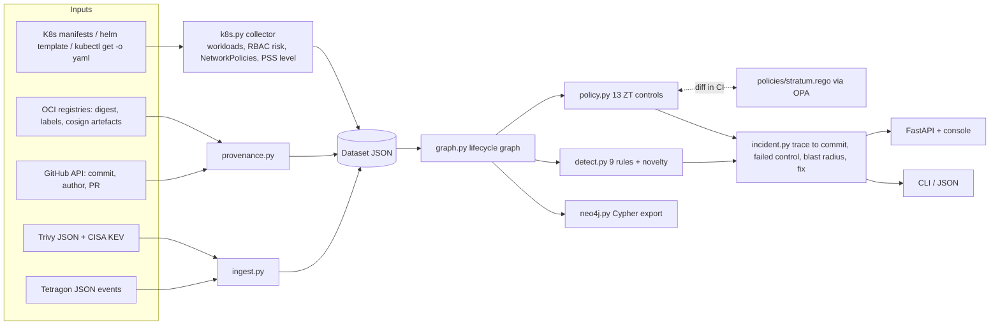

# Architecture



## Data model

Every collector emits the same `Dataset` (`stratum/dataset.py`), a JSON-serialisable bundle of dataclasses:

| Entity | Real source | Graph node id |
|---|---|---|
| `Commit` | GitHub commits API (verified) | `commit:<sha>` |
| `Build` | OCI revision label -> commit (`oci:<digest12>`) | `build:<id>` |
| `Image` | manifest image ref, resolved digest, base OS from Trivy | `image:<ref>` |
| base image | `ImageReport.os` (e.g. `debian 12.13`) | `base:<os>` |
| `Workload` | Deployment / StatefulSet / DaemonSet / Job / CronJob / Pod | `workload:<ns>/<name>` |
| pod | workload replica, or a runtime-only pod seen by Tetragon | `pod:<ns>/<pod>` |
| `ServiceAccount` | SA plus RBAC risk derived from (Cluster)Role(Binding)s | `sa:<ns>/<name>` |
| `NetworkPolicy` | NetworkPolicy objects | `netpol:<ns>/<name>` |
| `RuntimeEvent` | Tetragon `process_exec` / `process_connect` / `process_kprobe` | (events, not nodes) |
| `ImageReport` | Trivy JSON: vulns by severity, KEV hits, shells, OCI labels | attributes on `image:` |

The lifecycle spine is `commit -BUILDS-> build -PRODUCES-> image -DEPLOYS-> workload -RUNS-> pod`, with side edges `base -BASE_OF-> image`, `ns -CONTAINS-> workload`, `sa -IDENTITY_OF-> workload`, `netpol -GUARDS-> ns`, and (on export) `subject -VIOLATES-> control`.

## Zero-Trust controls

| id | control | evidence used |
|---|---|---|
| ZT-NET-01 | default-deny egress per namespace | NetworkPolicy with `Egress` in the namespace |
| ZT-WL-01 | no privileged / root containers (PSS baseline) | PSS baseline checks, privileged, runAsUser 0, host namespaces |
| ZT-WL-02 | Pod Security Standard *restricted* | remaining PSS restricted checks |
| ZT-ID-01 | dedicated workload identity | `serviceAccountName` unset or `default` |
| ZT-ID-02 | no token automount for privileged identities | effective `automountServiceAccountToken` and SA RBAC risk |
| ZT-ID-03 | no cluster-admin workloads | ClusterRoleBinding to `cluster-admin` |
| ZT-ID-04 | no cluster-wide secret read or RBAC escalation | ClusterRole rules (secrets get/list/watch, `*`/`*`, bind/escalate) |
| ZT-PROV-01 | only trusted-pipeline images | image has a verified build -> commit edge |
| ZT-PROV-02 | signed builds | cosign signature artefact present |
| ZT-PROV-03 | digest-pinned images | `@sha256:` in the image reference |
| ZT-IMG-01 | no deny-listed / critical-CVE images | Trivy CRITICAL findings (or synthetic deny-list) |
| ZT-IMG-02 | minimal images without a shell | shell packages in the SBOM (bash, busybox, dash, ...) |
| ZT-IMG-03 | no KEV-listed vulnerabilities | Trivy CVEs ∩ CISA KEV |

## Runtime rules

| rule | trigger | control named |
|---|---|---|
| R-ESCAPE | `nsenter`/`unshare`/`chroot` into PID 1 namespaces | ZT-WL-01 |
| R-SA-TOKEN | open of `.../serviceaccount/token` | ZT-ID-02 |
| R-CRED-READ | ssh keys, keystores, cloud/kube credentials | ZT-ID-04 |
| R-SYS-WRITE | writes to `/etc/passwd`, `/etc/shadow`, sudoers, ... | ZT-WL-02 |
| R-UNMANAGED | process in a container with no pod (not deployed via K8s) | ZT-PROV-01 |
| R-TMP-EXEC | exec from `/tmp`, `/dev/shm`, `/var/tmp` | ZT-WL-02 |
| R-NETTOOL | nc, socat, nmap, ssh, scp, ... | ZT-IMG-02 |
| R-SHELL | interactive shell binary | ZT-IMG-02 |
| R-EGRESS | connect to a non-RFC1918/CGNAT/ULA address | ZT-NET-01 |
| A-NOVEL | per-workload novelty over (event, process, port/path) | ZT-IMG-02 |

## Neo4j

```bash
docker compose up -d neo4j
python -m stratum export --data real --format cypher --out graph.cypher
docker compose exec -T neo4j cypher-shell -u neo4j -p stratum-lab < graph.cypher
```

Example queries (also in `stratum.neo4j.QUERIES`):

```cypher
// every workload built on a given base OS layer
MATCH (b:BaseImage {id: "base:debian 12.13"})-[:BASE_OF]->(:Image)-[:DEPLOYS]->(w:Workload) RETURN w.id;
// full provenance path for a pod
MATCH p=(c:Commit)-[:BUILDS]->(:Build)-[:PRODUCES]->(:Image)-[:DEPLOYS]->(:Workload)-[:RUNS]->(:Pod {id: $pod}) RETURN p;
// namespaces with no NetworkPolicy
MATCH (n:Namespace) WHERE NOT (:NetworkPolicy)-[:GUARDS]->(n) RETURN n.id;
```
