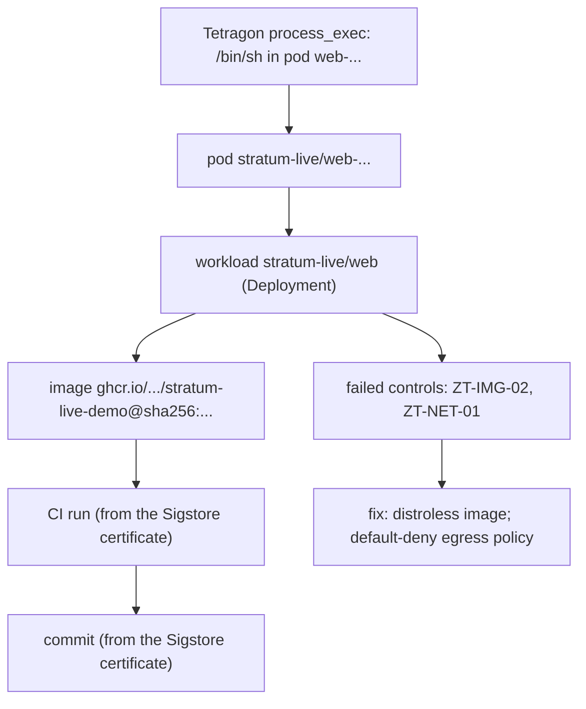

# How it works: one incident, end to end

This page follows one real alert from the [live CI job](live.md) through every hop STRATUM draws. Each hop
names the evidence it rests on. Hops that are only asserted, not checked against evidence, are labelled.

*The console replaying job 1 of live run [37085766270](https://github.com/rakshit-737/stratum/actions/runs/37085766270) (commit 38cc4a3).*

## 1. The runtime event

Tetragon (eBPF, Helm chart 1.7.1) runs in a kind cluster on the GitHub runner. `deploy/live/actions.sh` runs
benign, attack-shaped commands in the `web` pod: a shell, `cat` of the projected service-account token
(to `/dev/null`) and `nc` to an in-cluster sink. Tetragon exports JSON such as `process_exec` with the pod
name, namespace and the **container image digest** the kernel saw. `stratum.ingest.tetragon_events` parses it.

*Evidence:* the kernel sensor. Nothing is scripted into the event.

## 2. Event to pod to workload

The pod comes from the event. The pod-to-workload edge comes from `kubectl get pods -o json`
(`ownerReferences`, ReplicaSet to Deployment), and the workload spec from the rendered manifest.

*Evidence:* the cluster API.

## 3. Workload to image digest

The manifest pins the image by digest. STRATUM checks that the digest in the Tetragon event equals the
digest the job pushed; the live check fails otherwise.

*Evidence:* registry digest plus the kernel's view of the running container.

## 4. Image to CI run to commit

The job signs the digest with `cosign` (keyless, GitHub OIDC). Fulcio issues a short-lived certificate with
GitHub's claims: the commit (OID `1.3.6.1.4.1.57264.1.3`), the repository and the run-invocation URI (run id).
`stratum.sigstore.parse_cosign_verify` reads these from `cosign verify -o json` after verification against the
exact workflow identity. **The build and commit nodes are built only from that certificate.** The workflow's
`github.sha` is passed to `live-check` only as the expected value, so the check fails if the running image
was built by a different commit, or not signed at all.

Each live job builds and signs its own image (a per-job nonce makes the digest unique), and
`--expect-build` requires the certificate to name this CI run, so a certificate from an earlier run cannot be
reused. In the committed 5-job run the commit hop was read from 5 distinct certificates over 5 distinct digests
([results/live.md](https://github.com/rakshit-737/stratum/blob/main/results/live.md)).

*Negative controls,* both running the same shell command as the demo pod:

- `drift`: the upstream, digest-pinned `busybox:1.36.1` image. No signature and no revision label, so its
  incidents reach no commit and name `ZT-PROV-01` (image not from the trusted pipeline).
- `forged`: built in the same job from the same Dockerfile, **with the right `org.opencontainers.image.revision`
  label**, pushed to the same repository, never signed. It is the look-alike that label-based provenance cannot
  tell apart from the real image.

### What each join edge adds (A0-A4)

On the same run's evidence, `stratum.live.ablation` re-joins the incidents with less, or looser, provenance:

| Arm | Evidence | Demo pod to workload | Demo pod to the right commit | `forged` wrongly traced | Gap named on the controls |
|---|---|:-:|:-:|:-:|:-:|
| A0 | runtime events only | no | no | no | no |
| A1 | + cluster state (manifests, pods) | yes | no | no | yes |
| A2 | + label provenance (OCI revision label, unverified) | yes | yes | **yes** | yes |
| A3 | + certificate provenance, digest-exact (STRATUM) | yes | yes | **no** | yes |
| A4 | certificate provenance joined by repository | yes | yes | **yes** | no |

Each cell held in 5 of 5 runs of the committed dispatch. The outcomes are fixed by construction (the forged
image has the right label and the same repository), so the table demonstrates the join semantics on real sensor
output; it does not estimate a rate. Only A3 both traces the real image and refuses the forged one. A2 is what a
scanner or SBOM tool that reads the revision label would conclude.

## 5. Failed controls and fix

`stratum.policy.evaluate` checks 13 Zero-Trust controls on the graph. For this pod: the image ships a shell
(`ZT-IMG-02`, which the R-SHELL rule then sees used) and the namespace has no default-deny egress policy
(`ZT-NET-01`). The incident carries a fix for each.

## 6. Prevention, checked live

`stratum prevent stratum-live` emits a default-deny egress NetworkPolicy that still allows in-cluster
traffic. The job applies it and repeats an `nc` connect to a sink outside the cluster CIDRs (started by the
job on the runner's own `kind` Docker network): allowed before, blocked after, while the in-cluster sink stays
reachable. kind enforces NetworkPolicy natively (kube-network-policies).

## What this does not show

- It is a scripted pipeline check on real sensor output, not a detection-rate study; the actions are few and
  known in advance. Detection rates on attack data are in [Evaluation](evaluation.md).
- Only the CI demo image carries a verifiable certificate. For the 86 third-party images in the real corpus,
  the commit edge rests on OCI labels confirmed by the GitHub API, and signatures (cosign tags or Sigstore
  bundles) are only detected, not verified.
- All five live images were built from one commit, so the run-level intervals cover detection, capture and the
  certificate join, not a variety of commits or workloads.
