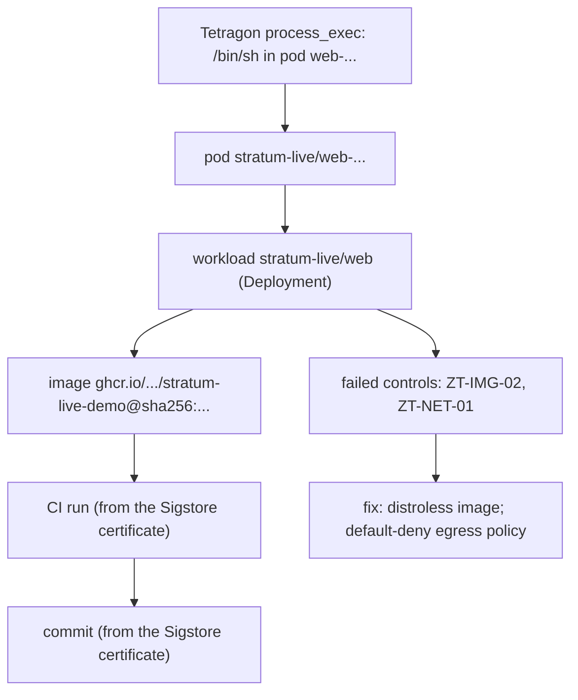

# How it works: one incident, end to end

This page follows one real alert from the [live CI job](live.md) through every hop STRATUM draws. Each hop
names the evidence it rests on. Hops that are only asserted, not checked against evidence, are labelled.

## 1. The runtime event

Tetragon (eBPF, Helm chart 1.7.1) runs in a kind cluster on the GitHub runner. `deploy/live/actions.sh` runs
benign, attack-shaped commands in the `web` pod: a shell, `cat` of the projected service-account token
(to `/dev/null`) and `nc` to an in-cluster sink. Tetragon exports JSON such as `process_exec` with the pod
name, namespace and the **container image digest** the kernel saw. `stratum.ingest.tetragon_events` parses it.

*Evidence:* the kernel sensor. Nothing is scripted into the event.

## 2. Event to pod to workload

The pod comes from the event. The pod-to-workload edge comes from `kubectl get pods -o json`
(`ownerReferences`, ReplicaSet to Deployment), and the workload spec from the rendered manifest.

*Evidence:* the cluster API.

## 3. Workload to image digest

The manifest pins the image by digest. STRATUM checks that the digest in the Tetragon event equals the
digest the job pushed; the live check fails otherwise.

*Evidence:* registry digest plus the kernel's view of the running container.

## 4. Image to CI run to commit

The job signs the digest with `cosign` (keyless, GitHub OIDC). Fulcio issues a short-lived certificate with
GitHub's claims: the commit (OID `1.3.6.1.4.1.57264.1.3`), the repository and the run-invocation URI (run id).
`stratum.sigstore.parse_cosign_verify` reads these from `cosign verify -o json` after verification against the
exact workflow identity. **The build and commit nodes are built only from that certificate.** The workflow's
`github.sha` is passed to `live-check` only as the expected value, so the check fails if the running image
was built by a different commit, or not signed at all.

*Negative control:* a digest-pinned upstream `busybox` workload (`drift`) runs the same command. It has no
signature, so its incidents reach no commit and name `ZT-PROV-01` (image not from the trusted pipeline).

## 5. Failed controls and fix

`stratum.policy.evaluate` checks 13 Zero-Trust controls on the graph. For this pod: the image ships a shell
(`ZT-IMG-02`, which the R-SHELL rule then sees used) and the namespace has no default-deny egress policy
(`ZT-NET-01`). The incident carries a fix for each.

## 6. Prevention, checked live

`stratum prevent stratum-live` emits a default-deny egress NetworkPolicy that still allows in-cluster
traffic. The job applies it and repeats an `nc` connect to a sink outside the cluster CIDRs (started by the
job on the runner's own `kind` Docker network): allowed before, blocked after, while the in-cluster sink stays
reachable. kind enforces NetworkPolicy natively (kube-network-policies).

## What this does not show

- It is a scripted pipeline check on real sensor output, not a detection-rate study; the actions are few and
  known in advance. Detection rates on attack data are in [Evaluation](benchmarks.md).
- Only the CI demo image carries a verifiable certificate. For the 86 third-party images in the real corpus,
  the commit edge rests on OCI labels confirmed by the GitHub API, and cosign signatures are only detected.
